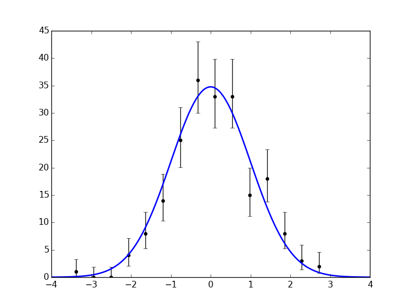
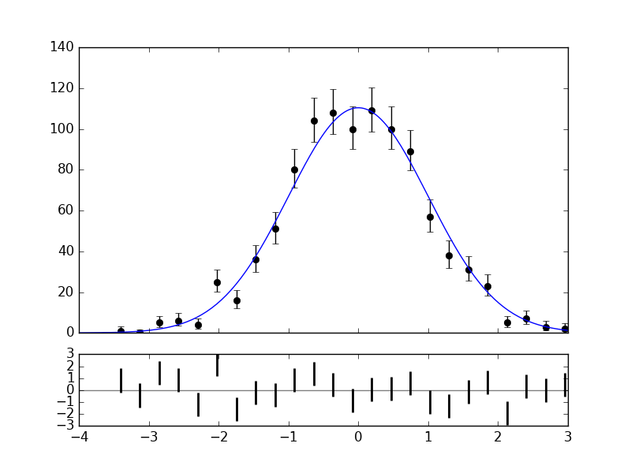

# matplotlib-hep

An add-on for matplotlib that simplifies the creation of plots for high energy physics.

## Getting started

This package is not yet on PyPI.
You can install it from this repository by running
```bash
pip install --user git+https://github.com/ibab/matplotlib-hep
```

## The histpoints plotting function

In high energy physics (HEP), histograms are often displayed as a collection of
data points, one for each bin. This allows one to easily compare the data to
an underlying probability model.

It can be debated if it is correct to attach error bars to the individual bin
contents as opposed to the underlying model, as we want to know if our
expectation for any given bin could fluctuate to match the data and not vice
versa. But this is a convention widely used by the HEP community, and thus a
way to use this kind of plot in Python is often necessary.

A simple way to create these kinds of plots is missing from other Python
packages like matplotlib. The `histpoints` function is designed to produce
these plots conventiently, like in the following example:

```python
from matplotlib_hep import histpoints
import matplotlib.pyplot as plt
import numpy as np
import scipy.stats as stats

data = np.random.normal(0, 1, 200)
x, y, norm = histpoints(data)

xs = np.linspace(-4, 4, 200)
plt.plot(xs, norm * stats.norm.pdf(xs, 0, 1), 'b-', lw=2)

plt.savefig('histpoints.png')
```

<div align="center"></div>

Or, displaying horizontal error bars to mark the bin width:
```python
histpoints(data, xerr='binwidth')
```

<div align="center"></div>

Note that the `histpoints` function returns the `x` and `y` coordinates of the
points, as well as `norm`, the integral of the histogram. This can be used to
scale a probability distribution to the histogram, as opposed to the other way
around, like in the example above.
This is often preferred in HEP, as it allows you to gauge the amount of entries
in your data sample more easily.

By default, `histpoints` chooses the number of bins automatically via the
[Freedman-Diaconis](https://en.wikipedia.org/wiki/Freedman%E2%80%93Diaconis_rule)
rule.

## The plot\_pull function

```python
from matplotlib_hep import plot_pull
import matplotlib.pyplot as plt
import numpy as np
import scipy as sp

data = np.random.normal(0, 1, 1000)

func = lambda x: sp.stats.norm.pdf(x, 0, 1)

plot_pull(data, func)
plt.savefig('pull.png')
```

<div align="center"></div>

